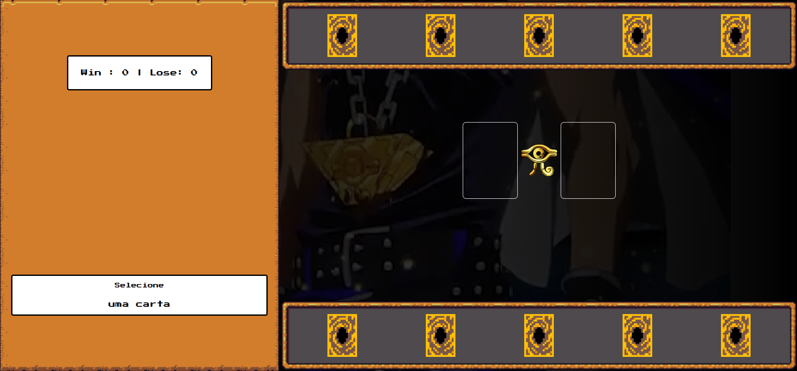
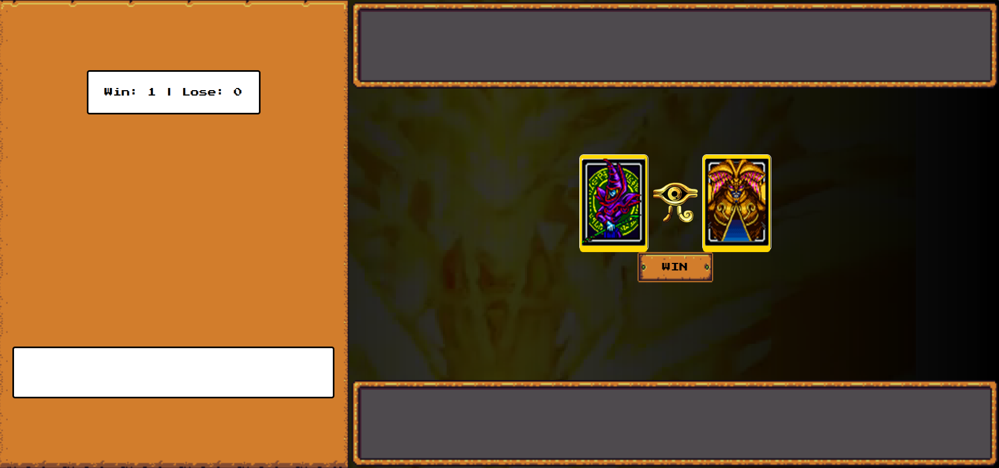

# 📂 Projeto Jogo Yugioh

## 📃 Projeto desenvolvido durante Bootcamp Potência Tech iFood - Desenvolvimento de Jogos na plataforma da DIO

 

## 🚀 Tecnologias

- HTML
- CSS
- JavaScript
- Git e Github

 

## 💻 Projeto
> Frontend da aplicação 📸

  
  

[Acessar o projeto](https://wsawebmaster.github.io/js-yugioh/)

 

## 🎯 Como Jogar

1. Clique sobre uma das cartas, observando sua identificação ao mover o mouse

---
---
## 📧 Contato
[LinkedIn](https://www.linkedin.com/in/wsawebmaster/)

wsawebmaster@yahoo.com.br

# Yu-Gi-Oh | Jo-ken-po Edition

Jogo de jokenpo que criei para explicar conceitos de lógica de programação aplicados a jogos

conceitos abordados:

- Armazenamento e gerenciamento de estado manual
- Funções limpas
- Organização de código
